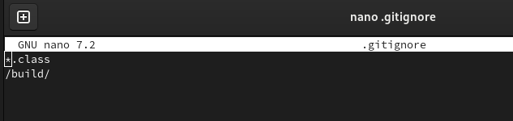
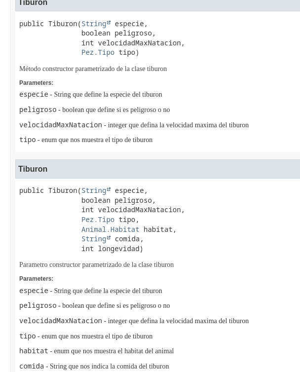
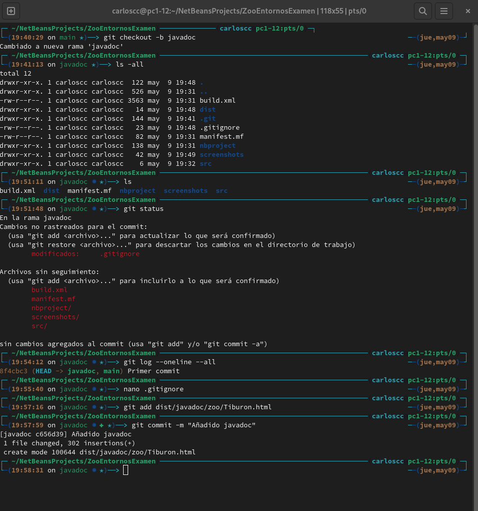
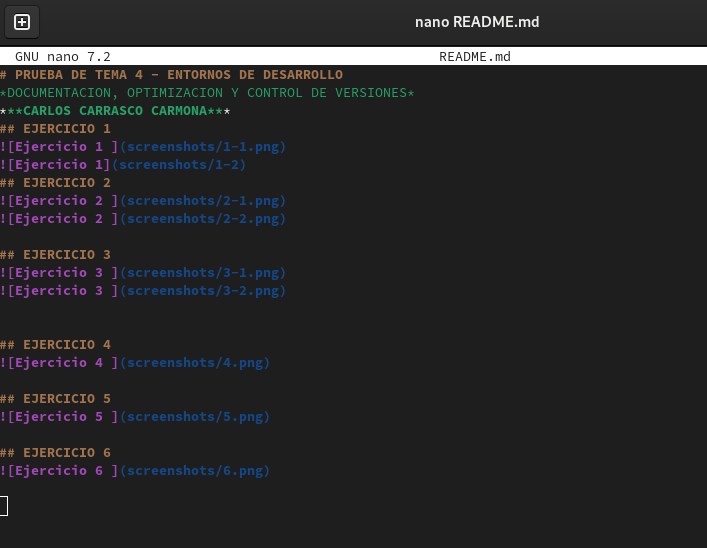
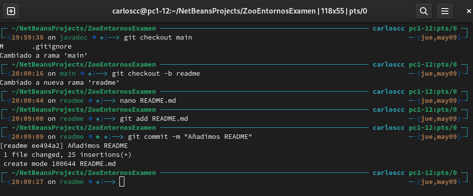
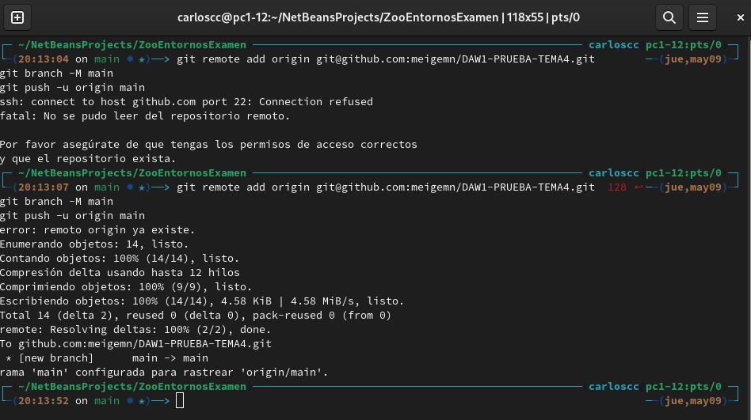
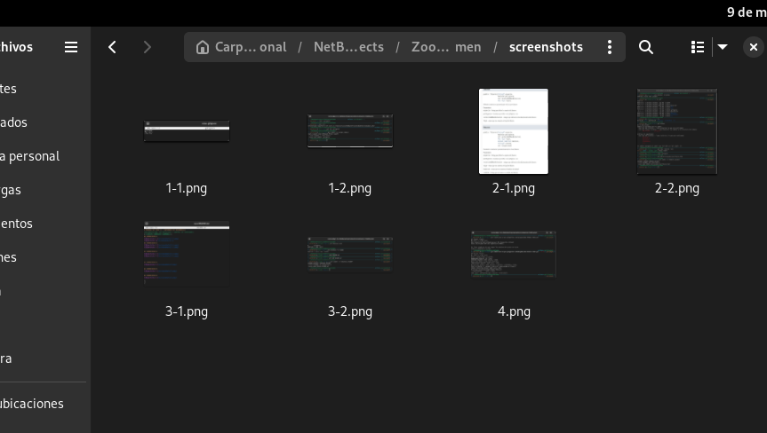
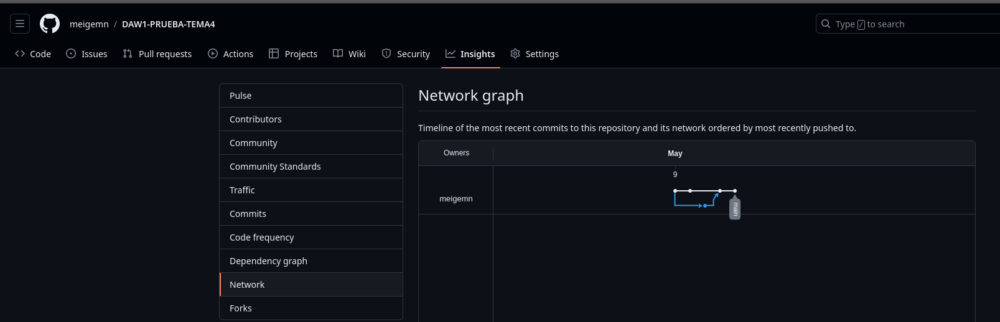

# PRUEBA DE TEMA 4 - ENTORNOS DE DESARROLLO
*DOCUMENTACION, OPTIMIZACION Y CONTROL DE VERSIONES*
***CARLOS CARRASCO CARMONA***
## EJERCICIO 1

 
## EJERCICIO 2
 
 

## EJERCICIO 3

 
 
 
## EJERCICIO 4
 
 
## EJERCICIO 5
 
 
## EJERCICIO 6
 
 

